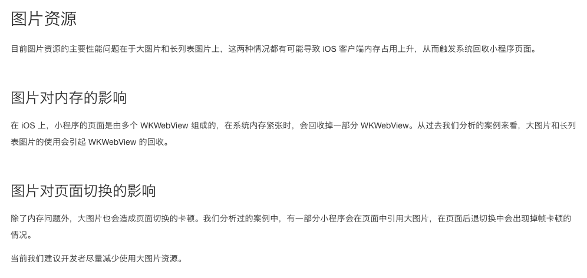

# mina-lazy-image

小程序图片懒加载组件

## 背景



小程序原生图片组件 `image` 提供的图片懒加载功能限制过多，只针对 `page` 与 `scroll-view` 下的 `image` 有效。

## 实现

`mina-lazy-image` 在小程序基础库 `1.9.3` 以上版本启用图片懒加载，当图片出现在`视口`内时加载图片。对于低版本，则直接显示图片。

## 使用

### 安装组件

```npm install mina-lazy-image --save```

### 配置组件

```
{
  "usingComponents": {
    "lazy-image": "path/to/mina-lazy-image"
  }
}
```

### 使用组件

```
<lazy-image mode="{{mode || 'aspectFill'}}" styles="{{styles}}" src="{{src}}"></lazy-image>
```

Tips:

- 请务必通过 styles 给图片设置宽高
